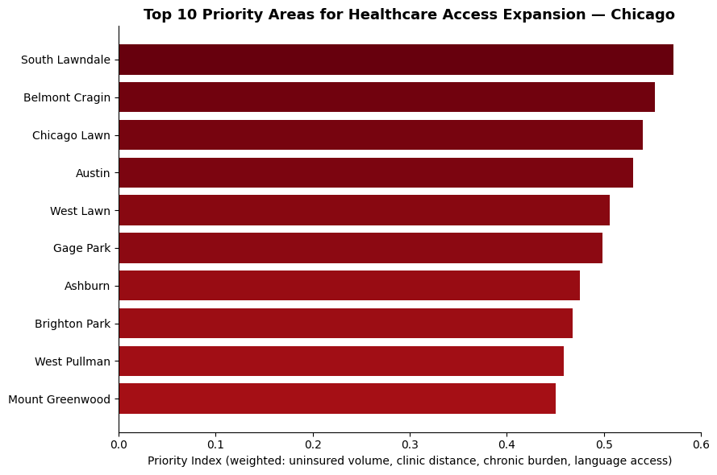
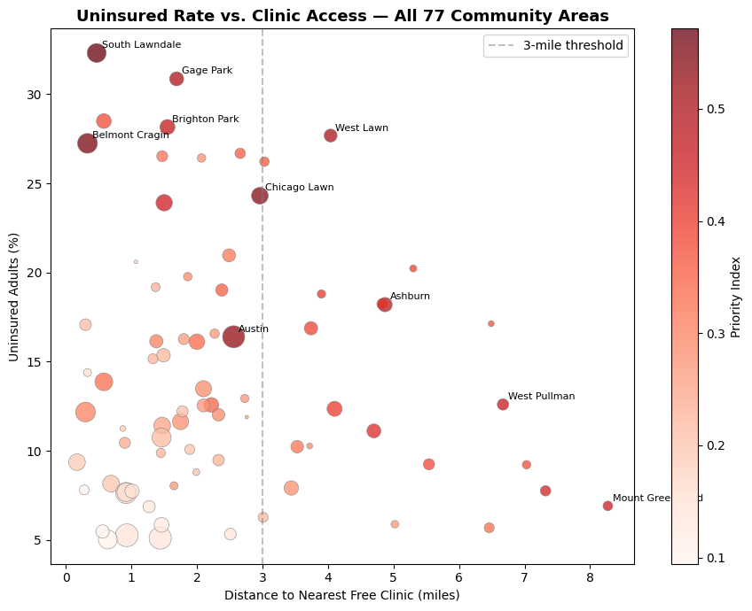

# Chicago Healthcare Access Gap

A geospatial analysis identifying which Chicago neighborhoods have the greatest unmet
need for free and charitable healthcare access — built to answer the kind of
resource-allocation question a healthcare safety-net organization has to make with
limited resources.

## The Question

If an organization wanted to expand free healthcare access in Chicago, which
neighborhoods should they prioritize first?

This isn't just "where is the uninsured rate highest." A neighborhood can have a high
rate but a small population, or high need but an existing clinic nearby. The goal was
to build a single, defensible way to rank all 77 Chicago community areas that accounts
for multiple dimensions of need at once.

## Key Findings

- **31% of the city's estimated uninsured adults** live in just 10 of Chicago's 77
  community areas — led by **South Lawndale, Belmont Cragin, and Chicago Lawn**.
- Those same 10 areas have **nearly double the limited-English-proficiency rate**
  of the citywide average (**24% vs. 14%**), suggesting language access and insurance
  access are correlated, not independent problems.
- **4 of the 10 priority areas** — West Lawn, Ashburn, West Pullman, and Mount
  Greenwood — sit more than 3 miles from the nearest clinic in the directory used here.
- Cross-referencing against real free-clinic locations in Chicago, **two of the top
  three priority areas already have a free-clinic presence** (Belmont Cragin and
  South Lawndale/Little Village), while **Chicago Lawn — the #3 priority area — does
  not** appear to have one in this directory. This suggests it may be worth
  investigating as a potential expansion target.

*Priority Index, a weighted composite of uninsured volume, clinic distance, chronic
disease burden, and language access (see Methodology).*

*Each point is a community area. Point size reflects population; color reflects the
priority index. The dashed line marks the 3-mile distance threshold.*

## Data Sources

| Source | What it provided | Vintage |
|---|---|---|
| [Chicago Health Atlas](https://chicagohealthatlas.org/) | Uninsured rate, chronic disease indicators (diabetes, hypertension, obesity), limited English proficiency, population — by community area | Uninsured rate: 2023 ACS (Table B21001); language: ACS 2020-2024 5-Year; chronic disease: Healthy Chicago Survey 2023-2024 |
| [Illinois Association of Free & Charitable Clinics](https://www.illinoisfreeclinics.org/) | Directory of free/charitable clinics statewide, filtered to 18 Chicago-proper (606xx) locations with fixed addresses | Directory pull, July 2026 |

**Note on mixed vintages:** each indicator in the Health Atlas dataset comes from
whichever source release was most current at the time of query, so this dataset spans
several years rather than a single snapshot. This is normal for aggregated public
health data, but worth being explicit about — see Limitations.

## Methodology

**1. Data cleaning.** Checked for duplicate rows, missing values (3 of 77 rows were
missing diabetes data — filled with the median), and implausible values (percentages
outside 0-100, non-positive population).

**2. Clinic geocoding.** Clinic addresses were geocoded using `geopy` with the
Nominatim (OpenStreetMap) service to get latitude/longitude for each of the 18
locations.

**3. Distance calculation.** For each of the 77 community areas, calculated the
straight-line (haversine) distance to the nearest of the 18 clinics.

**4. Estimating uninsured adult counts.** The Health Atlas provides uninsured *rate*
(% of adults 18-64), not a person count. Adult population was estimated as 62% of each
area's total population (a citywide average ratio, not an area-specific figure), then
multiplied by the uninsured rate to get an estimated count.

**5. Weighted priority index.** Four factors were min-max normalized to a 0-1 scale
and combined into a single index per community area:

| Factor | Weight | Rationale |
|---|---|---|
| Estimated uninsured adult volume | 40% | Prioritizes reaching the largest number of people, not just the highest rate |
| Distance to nearest free clinic | 30% | Direct measure of the physical access gap |
| Chronic disease burden (avg. of diabetes, hypertension, obesity rates) | 20% | Reflects urgency of ongoing care needs |
| Limited English proficiency | 10% | A barrier to effective care even where a clinic exists |

Volume and distance carry the most weight because the guiding question was
"where would a new clinic reach the most people with the least existing access,"
not "where is the population *proportionally* most affected." A small neighborhood
with a very high uninsured rate can rank below a larger neighborhood with a more
moderate rate — this is a deliberate tradeoff, not an oversight (see Limitations).

## Limitations

- **Adult population is an estimate, not a direct figure.** The 62% adult-share ratio
  is a citywide average applied uniformly; actual age distribution varies by
  neighborhood.
- **Clinic distances are straight-line, not drive or transit time.** Real-world
  accessibility depends on transportation, not just physical distance.
- **The clinic directory is not necessarily exhaustive.** It reflects one point-in-time
  pull from a single source and excludes mobile-only clinics, FQHCs, and hospital
  charity-care programs — it specifically models the free/charitable clinic safety net.
- **Volume-weighting deprioritizes small, high-rate neighborhoods.** The index favors
  total people reached over proportional severity. A neighborhood with a smaller
  population but a very high uninsured rate may rank lower than its severity would
  suggest under a rate-only ranking.
- **Data vintages are mixed across indicators** (see Data Sources), so this should be
  read as "best available current estimate per indicator," not a single-point-in-time
  survey.

## Files

| File | Description |
|---|---|
| `Chicago_Healthcare.ipynb` | Full analysis notebook, start to finish |
| `chicago_health_atlas_clean.csv` | Cleaned dataset, all 77 community areas with calculated fields |
| `ranked_priority_areas.csv` | Final ranked output with priority index |
| `clinics_geocoded.csv` | 18 Chicago free/charitable clinics with coordinates |
| `chart_top10_priority.png` | Bar chart of the top 10 priority areas |
| `chart_scatter_access_gap.png` | Scatter plot of uninsured rate vs. clinic distance, all 77 areas |

## Tools

Python (pandas, numpy, matplotlib), geopy/Nominatim for geocoding.

## Author

Silvia Poulakidas | [LinkedIn](https://www.linkedin.com/in/silvia-poulakidas) | silviapoulakidas@gmail.com
